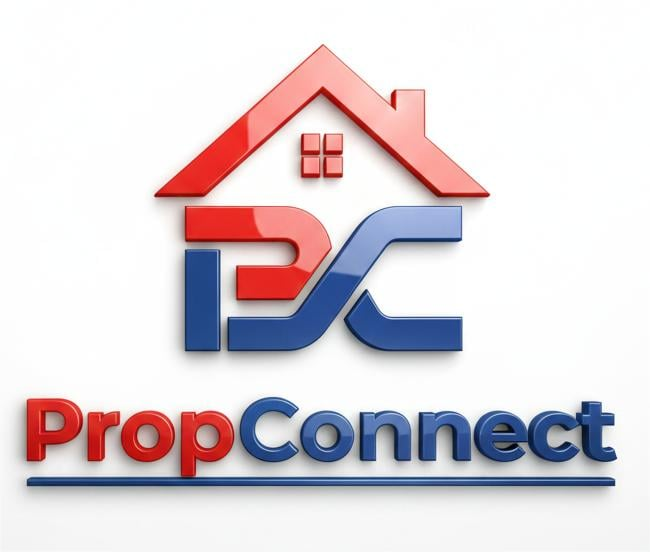

<p align="center">
  
</p>

<h1 align="center">PropConnect</h1>

<p align="center">
  <strong>AI-Driven Real Estate Web Application</strong><br/>
  <em>Accelerating property discovery and automating customer relationship management</em>
</p>

<p align="center">
  
  
  
  
  
  
</p>

---

## What is PropConnect?

**PropConnect** is an AI-driven web application engineered to accelerate the growth of real estate enterprises by leveraging intelligent agents to optimize property discovery and automate customer relationship management.

The platform utilizes autonomous AI agents to streamline property discovery and facilitate comprehensive customer relationship management — connecting tenants with landlords through an intuitive, modern interface.

### Key Features

- **AI-Powered Property Discovery** — Intelligent search and recommendation engine that helps tenants find their ideal rental property based on preferences, budget, and location
- **Interactive Map View** — Full Mapbox GL integration with street, satellite, and 3D views for exploring properties geographically
- **Real-Time Messaging** — Firebase-powered chat system enabling instant communication between tenants and landlords
- **Property Management Dashboard** — Landlords can list, edit, and manage their rental properties with image uploads and detailed specifications
- **Tenant Dashboard** — Personalized dashboard with saved favorites, recently viewed properties, active rentals, and quick messaging
- **Role-Based Authentication** — Separate flows for tenants and landlords with verification system
- **Email Notifications** — Automated email system via Resend for account verification and updates
- **Docker Ready** — Containerized deployment with Docker Compose

---

## Tech Stack

| Layer | Technology |
|-------|-----------|
| **Backend** | Laravel 12, PHP 8.2+ |
| **Frontend** | Blade Templates, TailwindCSS 4, Alpine.js |
| **Database** | PostgreSQL (Supabase) |
| **Real-Time Chat** | Firebase Realtime Database |
| **Maps** | Mapbox GL JS v3 |
| **Email** | Resend |
| **Build Tools** | Vite, PostCSS |
| **Deployment** | Docker, Docker Compose |

---

## Getting Started

### Prerequisites

- PHP 8.2+
- Composer
- Node.js 18+ & npm
- PostgreSQL (or Supabase account)
- Firebase project (for real-time chat)
- Mapbox account (for maps)

### Installation

```bash
# Clone the repository
git clone git@github.com:ImNew222/PropConnect.git
cd PropConnect

# Install PHP dependencies
composer install

# Install Node dependencies
npm install

# Environment setup
cp .env.example .env
php artisan key:generate
```

### Configure Environment

Edit your `.env` file with your credentials:

```env
# Database (Supabase PostgreSQL)
DB_CONNECTION=pgsql
DB_HOST=your-supabase-host.pooler.supabase.com
DB_PORT=5432
DB_DATABASE=postgres
DB_USERNAME=your_db_username
DB_PASSWORD=your_db_password

# Firebase (for real-time chat)
FIREBASE_API_KEY=your_firebase_api_key
FIREBASE_AUTH_DOMAIN=your_project.firebaseapp.com
FIREBASE_DATABASE_URL=https://your_project-default-rtdb.firebaseio.com
FIREBASE_PROJECT_ID=your_project_id
FIREBASE_STORAGE_BUCKET=your_project.firebasestorage.app
FIREBASE_MESSAGING_SENDER_ID=your_sender_id
FIREBASE_APP_ID=your_app_id

# Mapbox (for maps)
MAPBOX_ACCESS_TOKEN=your_mapbox_access_token

# Resend (for email)
RESEND_API_KEY=your_resend_api_key
```

### Run the Application

```bash
# Run migrations
php artisan migrate

# Start all services (server, queue, logs, vite)
composer dev
```

The app will be available at `http://localhost:8000`

### Docker Deployment

```bash
docker-compose up -d
```

---

## Project Structure

```
PropConnect/
├── app/
│   ├── Http/Controllers/
│   │   ├── ChatController.php          # AI chat & messaging
│   │   ├── RentalController.php        # Property listings & search
│   │   ├── ProfileController.php       # User profiles
│   │   ├── Landlord/                   # Landlord property management
│   │   └── Tenant/                     # Tenant dashboard & features
│   └── Models/                         # Eloquent models
├── resources/
│   └── views/
│       ├── homepage.blade.php          # Landing page
│       ├── rental.blade.php            # Property search & listings
│       ├── property-detail.blade.php   # Property detail with maps
│       ├── messages/                   # Chat system views
│       ├── tenant/                     # Tenant dashboard views
│       └── landlord/                   # Landlord management views
├── public/
│   ├── css/                            # Stylesheets
│   └── javascript/                     # Client-side scripts
├── database/
│   ├── migrations/                     # Database schema
│   └── seeders/                        # Sample data
├── config/services.php                 # API keys configuration
├── docker-compose.yml                  # Docker setup
└── .env.example                        # Environment template
```

---

## Team

Built for **Hackathon 2026**

---

## License

This project is open-sourced under the [MIT License](https://opensource.org/licenses/MIT).
